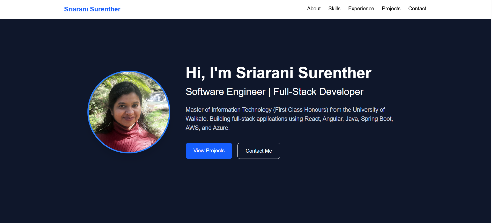
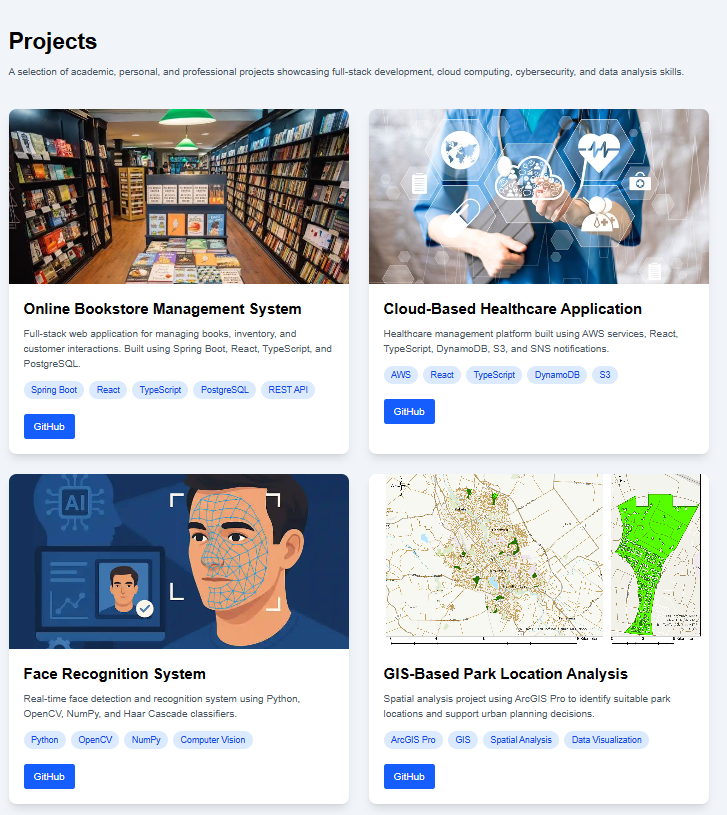

# 🌐 Personal Portfolio Website

## 👋 About the Project

This is my personal portfolio website showcasing my skills, projects, and experience as a Software Engineer / Full-Stack Developer.  
It is designed to present my work in a clean, responsive, and professional format for recruiters and collaborators.

---
## 🚀 Demo
https://sriarani-portfolio.vercel.app/

## 🛠️ Tech Stack

- React.js
- JavaScript / TypeScript
- HTML5
- CSS3
- Tailwind CSS
- Git & GitHub
- Vite

---

## 📌 Features

- Responsive design (mobile, tablet, desktop)
- Hero section with professional introduction
- About section highlighting education and experience
- Skills categorized by domain
- Projects section with GitHub links and screenshots
- Contact section with email and social links
- Clean UI with modern styling using Tailwind CSS

---

## 📁 Project Structure
portfolio/
├── public/
│ ├── profile.jpg
│ ├── project-images/
│
├── src/
│ ├── components/
│ │ ├── Hero.jsx
│ │ ├── About.jsx
│ │ ├── Skills.jsx
│ │ ├── Projects.jsx
│ │ ├── Contact.jsx
│ │
│ ├── App.jsx
│ ├── main.jsx
│
├── package.json
└── README.md

---

## 📸 Screenshots

### Home Page


### Projects Section


---

## 💼 Projects Highlighted

### 🛒 Online Bookstore Management System
- Full-stack web application for managing books, inventory, and customers
- Tech: Spring Boot, React, TypeScript, PostgreSQL, REST APIs

### ☁️ Cloud-Based Healthcare Application
- AWS-based healthcare management system with notifications and storage
- Tech: AWS, React, TypeScript, DynamoDB, S3

### 👁️ Face Recognition System
- Real-time face detection using OpenCV and Python
- Tech: Python, OpenCV, NumPy

### 🌍 GIS-Based Park Location Analysis
- Spatial analysis for urban planning using ArcGIS Pro
- Tech: GIS, ArcGIS Pro, Data Analysis

---

## 📬 Contact

- 📧 Email: arani.suren1630@gmail.com  
- 💼 LinkedIn: https://www.linkedin.com/in/sriarani-surenther  
- 💻 GitHub: https://github.com/sriarani16  
- 📍 Location: Hamilton, New Zealand  

---

## 🎯 Purpose

This portfolio is built to:
- Showcase my technical skills and projects
- Demonstrate full-stack development experience
- Support applications for Graduate Software Engineer roles

---

## ⚡ Future Improvements

- Add live deployment for all projects
- Integrate contact form with EmailJS / backend API
- Improve animations and UI transitions
- Add blog section for technical writing
```
```
